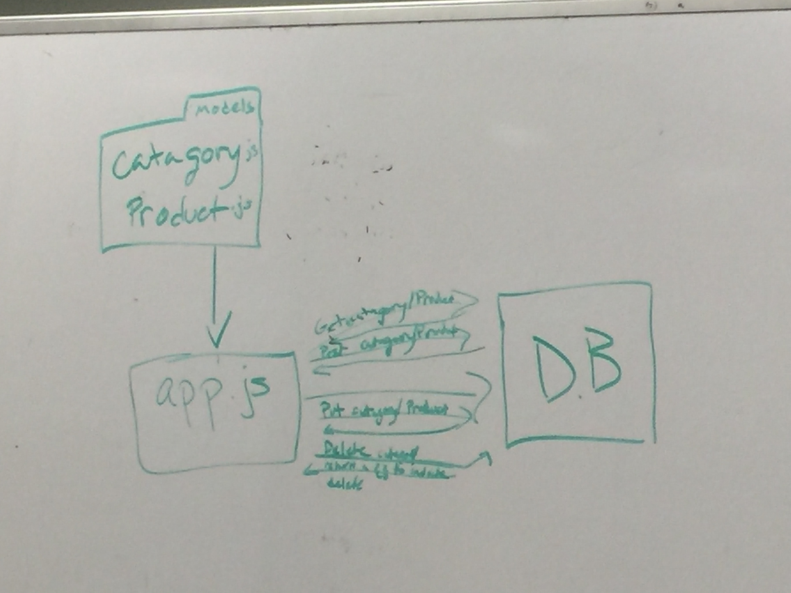

# lab-08

## Express Routing and Connected API

### Author: Adrienne Easton

### Links and Resources
* [submission PR](https://github.com/401-advanced-javascript-aeaston/lab-08-express-routing-and-connected-api/pull/3)
* [travis]()

#### Documentation
* [api docs](http://xyz.com) (API servers)
* [jsdoc](http://xyz.com) (Server assignments)
* [styleguide](http://xyz.com) (React assignments)

### Modules
#### `modulename.js`
##### Exported Values and Methods

###### `foo(thing) -> string`
Usage Notes or examples

###### `bar(array) -> array`
Usage Notes or examples

### Setup
#### `.env` requirements
* `PORT` - Port Number
* `MONGODB_URI` - URL to the running mongo instance/db

#### Running the app
To start type npm i.
  
#### Tests
To run tests type npm test.

#### UML

